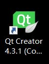
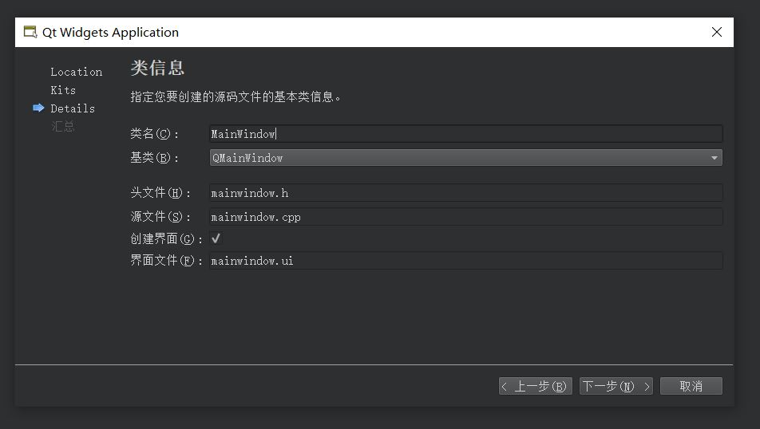
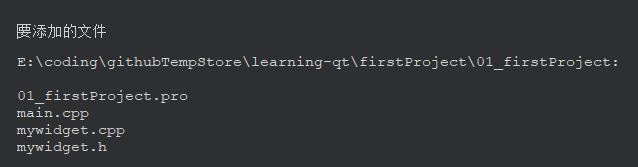
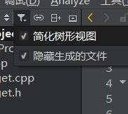

## 快速入门

#### 特点和优点
跨平台：IOS WINDOWS ANDROID 嵌入式
版本：商业版，开源版
#### 帮助界面
索引中进行查找
#### 工程创建
选项：Qt Widgets Application

名称和路径中不能有中文

主窗口基类选择
> QWidget,QDialog,QMainWindow[后两个是前一个的子类]
> QMainWindow有菜单栏和工具栏



> 勾选创建界面会生成界面文件【先不勾选】

生成的文件  


* **...pro**:项目工程文件，可以双击打开工程
* **main.cpp**:项目入口文件
* **mywidget.cpp**:窗口文件
* **mywidget.h**:窗口文件

#### 工程界面初识
###### 勾选简化的树形界面看到文件结构

右上角可以分栏

#### 代码快速入门
##### main.cpp
```c++
#include "mywidget.h"
#include <QApplication>//包含一个应用程序的类的头文件
//程序入口
int main(int argc, char *argv[])//两个参数：命令行变量的数量，命令行变量的数组
{
    QApplication a(argc, argv);//应用程序对象，在Qt中应用程序对象有且仅有一个
    myWidget w;//窗口对象
    w.show();//窗口对象的show方法【默认不显示，调用show来显示】
    //让应用程序对象【a】进入消息循环机制【类似死循环】
    return a.exec();
}
```
##### ...pro
```txt
QT       += core gui#Qt包含的模块

greaterThan(QT_MAJOR_VERSION, 4): QT += widgets#大于4版本以上 包含widgets模块

TARGET = 01_firstProject#目标 生成的.exe程序的名称
TEMPLATE = app#模板 应用程序模板

DEFINES += QT_DEPRECATED_WARNINGS

SOURCES += \#源文件 创建文件会自动更新
        main.cpp \
        mywidget.cpp

HEADERS += \#头文件
        mywidget.h

```
##### myWidget.h
```c++
#ifndef MYWIDGET_H
#define MYWIDGET_H//ifndef防止头文件重复编译

#include <QWidget>//包含头文件

class myWidget : public QWidget
{
    Q_OBJECT//一个宏，允许类中使用信号与槽的机制

public:
    myWidget(QWidget *parent = 0);//构造函数
    ~myWidget();//析构函数
};

#endif // MYWIDGET_H
```
##### myWidget.cpp
```c++
#include "mywidget.h"

myWidget::myWidget(QWidget *parent)
    : QWidget(parent)//调用父类的构造函数
{
}

myWidget::~myWidget()
{

}
```
#### 命名规范
**类名**：首字母大写，单词与单词之间大写
**函数名变量名**：首字母小写，单词与单词之间大写
#### 快捷键
整个注释：<kbd>ctrl</kbd>+<kbd>/</kbd>  

运行：<kbd>ctrl</kbd>+<kbd>r</kbd>  

编译：<kbd>ctrl</kbd>+<kbd>b</kbd>  

字体缩放：<kbd>ctrl</kbd>+鼠标滚轮  

查找关键字：<kbd>ctrl</kbd>+<kbd>f</kbd>  

整行移动：<kbd>ctrl</kbd>+<kbd>shift</kbd>+<kbd>↑</kbd> / <kbd>↓</kbd>

帮助文档：<kbd>F1</kbd> F1+代码中点击可以跳转到相应帮助，ESC退出

自动对齐：<kbd>ctrl</kbd>+<kbd>i</kbd>  

同名之间.h,.cpp切换：<kbd>F4</kbd>

*Vezzzing 2022.1.6于良渚CAA六号楼二楼自习室*