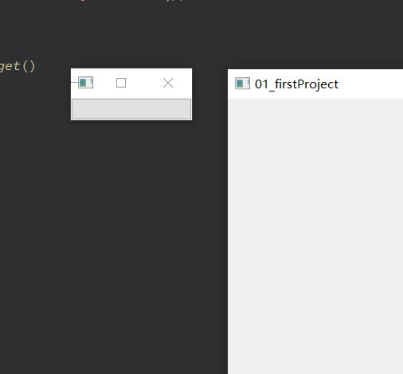
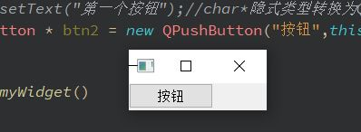
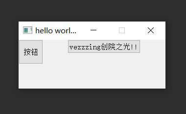

## QPushButton创建 & 窗口初识
#### 帮助文档
QPushButton Class
The QPushButton widget provides a command button. More...

Header:包含的头文件
```c++
#include <QPushButton> 
```
qmake:在[pro](../AAA/main.html)文件中导入模块
```txt
QT += widgets
```
Inherits:
```txt
QAbstractButton
```
Inherited By:
```txt
QCommandLinkButton
```

#### 快速 H W
修改mywidget.cpp:
```c++
#include "mywidget.h"
#include <QPushButton>
myWidget::myWidget(QWidget *parent)
    : QWidget(parent)
{
    //一般在构造函数中写
    QPushButton * btn=new QPushButton;//创建按钮
    btn->show();
}

myWidget::~myWidget()
{

}
```
直接在构造函数中show()会导致按钮以一个单独的窗口显示（顶层弹出）  


这么改，指定父级
```c++
#include "mywidget.h"
#include <QPushButton>
myWidget::myWidget(QWidget *parent)
    : QWidget(parent)
{
    //一般在构造函数中写
    QPushButton * btn=new QPushButton;//创建按钮
    btn->setParent(this);//this是当前对象【myWidget的指针】
    btn->setText("第一个按钮");//char*隐式类型转换为QString
}

myWidget::~myWidget()
{

}
```
#### 按钮创建
##### F1:
```c++
QPushButton * btn2 = new QPushButton("按钮",this);
```
这样做会导致窗口的大小等于按钮大小  


因此可以先这么创建按钮，然后重置窗口大小
#### 重置窗口大小
```c++
resize(300,300);
```

#### 移动按钮位置
```c++
btn1->move(100,0);
```
#### 修改按钮大小
```c++
btn2->resize(50,50);
```
#### 设置窗口标题
```c++
setWindowTitle("hello world Qt!");
```
#### 设置固定的窗口大小
用户不能缩放窗口
```c++
setFixedSize(300,300);
```
***
#### 代码总揽
mywidget.cpp:
```c++
#include "mywidget.h"
#include <QPushButton>
myWidget::myWidget(QWidget *parent)
    : QWidget(parent)
{
    QPushButton * btn1 = new QPushButton("vezzzing创院之光!!",this);
    QPushButton * btn2 = new QPushButton("按钮",this);
    resize(300,100);
    btn1->move(100,0);
    btn2->resize(50,50);
    setWindowTitle("hello world Qt!");
    setFixedSize(300,100);
}

myWidget::~myWidget()
{

}
```
运行效果：  

  

*Vezzzing 2022.1.6于良渚CAA六号楼二楼自习室*